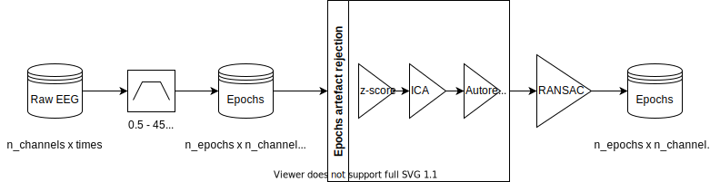

# eeg-workshop
 

Welcome to the EEG data preprocessing and analysis workshop with [meeg-tools](https://github.com/weiglszonja/meeg-tools)!


Made in association with the Lyon Neuroscience Research Center (Lyon), Memo Team,
PI: [Dezso Nemeth](https://www.memoteam.org).

# Dates
- **Day 1**: Thursday, February 3, 2022, 10:30AM - 3:30PM
- **Day 2**: Thursday, February 10, 2022, 10:30AM - 3:30PM

# Overview
This workshop will enable participants to work intensively with an EEG dataset;
to learn how to preprocess and analyse data with meeg-tools. 

# How to prepare?
Please make the necessary installations before the workshop, you can access the slides
for the initial setup from [here](https://github.com/weiglszonja/eeg-workshop/initial_python_project_setup.pdf). 
Feel free to reach out if you encounter any problems
during the setup.

# Agenda
Day 1  | Thursday, February 3
-------------   | -------------
10:30AM - 12PM  | Preprocessing tutorial
12PM - 1PM      | Lunch break
1PM - 1:30PM    | (Optional) Coffee & Questions
1:30PM - 3:30PM | Preprocessing tutorial

Day 2  | Thursday, February 10
------------- | -------------
10AM          | (Optional) Coffee & Questions
10:30 - 3:30PM| Analysis tutorial

# Clone the repository
```bash
$ git clone https://github.com/weiglszonja/eeg-workshop
```

# Install the requirements
```bash
$ pip install -r requirements.txt
```
If you are having an [issue](https://stackoverflow.com/questions/61359430/cannot-install-python-jupyter-or-jupyterlabs-on-windows-due-to-missing-pywin32) 
with installing `jupyter` on Windows, you have to install the `pywin32` package:
```bash
$ pip install pywin32
```
# Usage

Launch the preprocessing notebook from the terminal and follow the instructions described
within the notebook.  
For more reference, visit the project [documentation](https://github.com/weiglszonja/meeg-tools).

```bash
$ jupyter notebook preprocessing_tutorial_for_workshop.ipynb
```

# Outline

## Preprocessing



1. __Temporal filtering__

High-frequency artefacts and slow drifts are removed with a zero-phase bandpass filter 
using mne-Python [1]. 

2. __Create epochs__

Epochs are non-overlapping data segments created from the continuous data with a 
given duration.
Epochs can be created from (1) events; there is a custom method that created epochs 
based on annotations in the raw data, (2) without events, data segments are created 
from the beginning of the raw data. 

3. __Outlier data rejection__  

- _Preliminar rejection_

Epochs are rejected based on a global threshold on the z-score (> 3) of the epoch 
variance and amplitude range.

- _ICA decomposition_  

The default method is the infomax algorithm, however it can be changed in the 
configuration file along with the number of components and the decimation parameter. 
Components containing blink artefacts are automatically marked with mne-Python.
The ICA sourced can be visualized and interactively selected and rejected based on 
their topographies, time-courses or frequency spectra.

- _Autoreject_  

Autoreject [2, 3] uses unsupervised learning to estimate the rejection threshold for 
the epochs. In order to reduce computation time that increases with the number of 
segments and channels, autoreject can be fitted on a representative subset of epochs 
(25% of total epochs). Once the parameters are learned, the solution can be applied to 
any data that contains channels that were used during fit.

4. __Outlier channel interpolation__

The Random Sample Consensus (RANSAC) algorithm [4] selects a random subsample of good 
channels to make predictions of each channel in small non-overlapping 4 seconds long 
time windows. It uses a method of spherical splines (Perrin et al., 1989) to 
interpolate the bad sensors.

## References

[1] A. Gramfort, M. Luessi, E. Larson, D. Engemann, D. Strohmeier, C. Brodbeck, R. Goj, M. Jas, T. Brooks, L. Parkkonen, M. Hämäläinen, MEG and EEG data analysis with MNE-Python, Frontiers in Neuroscience, Volume 7, 2013, ISSN 1662-453X

[2] Mainak Jas, Denis Engemann, Federico Raimondo, Yousra Bekhti, and Alexandre Gramfort, “Automated rejection and repair of bad trials in MEG/EEG.” In 6th International Workshop on Pattern Recognition in Neuroimaging (PRNI), 2016.

[3] Mainak Jas, Denis Engemann, Yousra Bekhti, Federico Raimondo, and Alexandre Gramfort. 2017. “Autoreject: Automated artifact rejection for MEG and EEG data”. NeuroImage, 159, 417-429.

[4] Bigdely-Shamlo, N., Mullen, T., Kothe, C., Su, K. M., & Robbins, K. A. (2015). The PREP pipeline: standardized preprocessing for large-scale EEG analysis. Frontiers in neuroinformatics, 9, 16.

